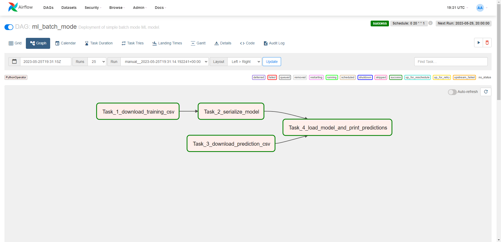
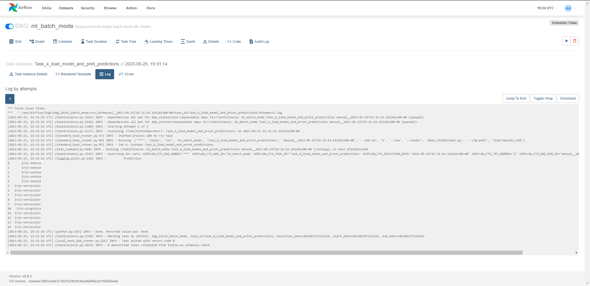

# Batch mode ML model deployment
Deployment of simple batch mode ML model in production.
In particular, a pipeline is implemented using airflow to train a ML model 
based on data in a s3 bucket and, then we print the prediction. Regarding the:
### **ML model**
- We will use a simple regression model (serialized using the 
`training.ipynb`)
### **Data**
We will use the _Iris_ dataset, divided as:
  - **Training** data: each line of the [data.txt](https://ub-2021.s3-eu-west-1.amazonaws.com/data/data.txt) contains a data file link
  - **Prediction** data: available [here](https://ub-2021.s3-eu-west-1.amazonaws.com/data/predict.csv)

## Launching Airflow

### Custom docker-compose

We need to open Airflow using the corresponding image.
For default standalone Python versions, one could use the 
`docker-compose.yaml`. It can be downloaded as:
```bash
curl -LfO 'https://airflow.apache.org/docs/apache-airflow/2.6.1/docker-compose.yaml'
```

However, since we need `sklearn` installed for this use-case, we will create
a custom `Dockerfile`:
```Dockerfile
FROM apache/airflow:2.6.1
ADD requirements.txt .
RUN pip install -r requirements.txt
```

And then we will replace the `image: ${AIRFLOW_IMAGE_NAME:-apache/airflow:2.6.1}` 
line of the `.yaml` by `build .`.

### Proper set up

Before executing Airflow, ensure you have 
[set it up](https://airflow.apache.org/docs/apache-airflow/stable/howto/docker-compose/index.html#setting-the-right-airflow-user) 
correctly. 

Some users may have `root` permission problems when 
executing Airflow, which can be avoided doing: 
```bash
mkdir -p ./dags ./logs ./plugins ./config
echo -e "AIRFLOW_UID=$(id -u)" > .env
```
Or if a warning persists the last line can be substituted by:
```bash
echo "AIRFLOW_UID=50000" > .env
```

The first time we run it we will need to create the **first user account** with:
```bash
docker compose up airflow-init --build
```
This sets up an `airflow:airflow` (`user:passwd`) account, and it is advisable
to run it even though it is not the first time. Afterwards, we clean 
everything up...
```bash
docker compose down --volumes --remove-orphans
```

And we are already ready to launch Airflow with
```bash
docker compose up --build
```

## Launching the scripts

The Airflow server is running and can be accessed at: `http://localhost:8080`.
Bear in mind this module must be placed at `./dags` to be found by Airflow.
Besides, to set up Airflow variables (_i.e._ `localpath`, `s3`) 
can be easily done using the dedicated GUI (`Admin` -> `Variables`) or the
Python corresponding class.

This way, inside the container, the variable 'variables' will be found using:
```python
from airflow.models import Variable
s3: str = Variable.get("s3")
```

## Results

Below a screenshot of both the Airflow DAG and execution are shown:


